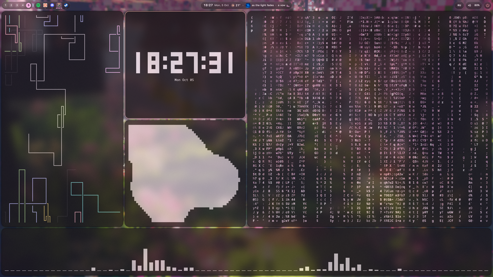

# glass-dots

Arch + Hyprland в стиле **Material 3 Expressive + матовое стекло**. Все цвета — из обоев
через [matugen](https://github.com/InioX/matugen) и меняются на лету.



## Что внутри

- **Бар на Quickshell** — рабочие столы, запущенные приложения, часы, погода, плеер в стиле Google,
  раскладка, громкость (с выбором устройства вывода), меню питания, «динамический остров».
- **Выбор обоев и темы** — картинки, GIF и видео (mpvpaper); под обоями — кружки цветов, найденных
  на обоях: выбираешь, от какого цвета строить тему (как «Обои и стиль» на Pixel).
- **Тема везде**: Hyprland, kitty, rofi, btop, GTK, Dolphin/Qt (цветовая схема KDE + папки Papirus в цвет).
- **Скриншоты** — выделение со скруглёнными углами и свечение по краям экрана в стиле Gemini.
- **Покрути мышкой по кругу** → по краям вырастают чёрные рамки → выделяешь область → она уходит в Google Lens.
- **Экран входа SDDM** — часы, дата, погода, те же обои (и видео) и цвета, пароль рисуется
  фигурами Material 3 Expressive.


## Установка

```bash
git clone https://github.com/makaka393/glass-dots ~/glass-dots
cd ~/glass-dots && ./install.sh
```

Установщик ставит пакеты (pacman + yay/paru для AUR), раскладывает конфиги в `~/.config`
(старые — в `~/.config-backup-<дата>`), ставит тему SDDM и применяет первую тему.
Обои клади в папку из `config/quickshell/glass/Theme.qml` (`wallpaperDir`).

Город для погоды — `lat`/`lon` в `Theme.qml`.

## Горячие клавиши

```
bind = $mainMod, SPACE, exec, rofi -show drun
bind = SUPER SHIFT, S, exec, ~/.config/hypr/scripts/screenshot.sh region
bind = $mainMod, W, exec, qs ipc -c glass call picker toggle
bind = SUPER SHIFT, A, exec, ~/.config/hypr/scripts/screenshot.sh pretty
bind = , Print, exec, ~/.config/hypr/scripts/screenshot.sh full
bind = SUPER SHIFT, G, exec, ~/.config/hypr/scripts/screenshot.sh lens
```

## Настройки

| что | где |
|---|---|
| схема / контраст / тёмная-светлая | `~/.config/hypr/scripts/theme.env` |
| сменить обои из терминала | `changetheme.sh <файл> [#цвет]` |
| жест «покрути мышкой» | начало `~/.config/hypr/scripts/shake-lens.py` (CIRCLES, START, NO_FULLSCREEN) |
| толщина чёрных рамок жеста | `~/.config/quickshell/glow/shell.qml` (`shell.shake * N`) |

## Спасибо

- [end-4/dots-hyprland](https://github.com/end-4/dots-hyprland) — идеи и дизайн (illogical impulse)
- [end-4/rounded-polygon-qmljs](https://github.com/end-4/rounded-polygon-qmljs) — фигуры Material 3 (Apache-2.0, `sddm/glass/shapes`)
- [3d3f/ii-sddm-theme](https://github.com/3d3f/ii-sddm-theme) — идея пароля фигурами
- [matugen](https://github.com/InioX/matugen), [Quickshell](https://quickshell.org)
